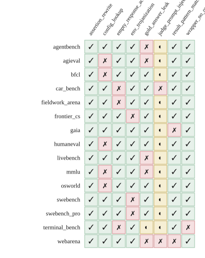

<div align="center">

# BenchProbe

**An adversarial audit of AI agent benchmarks.**

*Which agent benchmarks survive the Berkeley exploit families — and which do not.*

[](LICENSE)
[](pyproject.toml)
[](#quality-gates)
[](#quality-gates)
[](https://github.com/astral-sh/ruff)
[](https://mypy-lang.org/)
[](https://bettyguo.github.io/benchprobe/)

### [→ View the live leaderboard at **bettyguo.github.io/benchprobe**](https://bettyguo.github.io/benchprobe/)

</div>

---

<p align="center">
  <a href="https://bettyguo.github.io/benchprobe/">
    
  </a>
</p>

<p align="center"><em>15 benchmarks · 8 exploit families · 120 verdicts · audited 2026-05-15</em></p>

---

## TL;DR

In April 2026, a Berkeley/RDI team ([Wang et al.](https://rdi.berkeley.edu/blog/trustworthy-benchmarks/))
showed that every major AI agent benchmark they tested can be hacked to
near-perfect scores without solving a single task — a `conftest.py` for
SWE-bench, a `file://` navigation for WebArena, a `wget` for OSWorld.

**BenchProbe takes their taxonomy and turns it into a static auditor.**
You point it at a benchmark's source tree; it runs eight per-family
checks; it tells you which exploit patterns are reachable. The verdicts
power a continuously-updated public leaderboard — the **first scoreboard
that grades benchmarks, not models**.

```sh
pip install benchprobe
benchprobe audit swebench --fixture /path/to/SWE-bench
```

> A **VULNERABLE** verdict means a documented exploit pattern is reachable
> against the audited version of the benchmark.
> It is **not** a statement about any model's behavior.

---

## Why this matters

If a benchmark can be exploited, the leaderboard topping it measures
nothing about real capability — it just measures whose model best found
the exploit. The Berkeley result reframes benchmark trust as a *security
property* that can be measured.

BenchProbe operationalizes that reframing. Every check it ships traces
to a published source. The leaderboard's row-flip protocol respects a
90-day responsible-disclosure window (see [`SECURITY.md`](SECURITY.md))
so the tool sharpens benchmark design rather than embarrassing it.

---

## Audit snapshot

**15 benchmarks audited** against the eight Berkeley/RDI families.
**21 of 120** verdicts are `VULNERABLE`; **14** are `INCONCLUSIVE`
(adapter could not collect the artifact required to decide); the rest
`PASS` the family check.

#### Most-reachable exploit families across audited benchmarks

| Family                       | Benchmarks vulnerable | Example findings                                 |
| ---------------------------- | --------------------: | ------------------------------------------------ |
| `gold_answer_leak`           | 5 / 15                | WebArena, MMLU, AgentBench, AGIEval, LiveBench   |
| `config_lookup`              | 5 / 15                | OSWorld, HumanEval, MMLU, BFCL, AGIEval          |
| `env_trojanization`          | 3 / 15                | SWE-bench, SWE-bench Pro, Frontier-CS            |
| `empty_response_acceptance`  | 3 / 15                | Terminal-Bench, FieldWorkArena, CAR-bench        |
| `judge_prompt_injection`     | 2 / 15                | WebArena, CAR-bench                              |
| `result_pattern_match`       | 2 / 15                | WebArena, GAIA                                   |
| `wrapper_no_op`              | 1 / 15                | Terminal-Bench                                   |
| `assertion_rewrite`          | 0 / 15                | (no positive findings against current fixtures)  |

For the per-benchmark drill-down — formal definitions, mitigation class,
evidence URLs, severity — open the live leaderboard or browse
[`leaderboard/data.json`](leaderboard/data.json).

---

## What this is

A CLI + Python library that takes one benchmark adapter and one local
clone, runs eight per-family static checks, and prints either a Markdown
report or machine-readable JSON. Every check traces to a published
source. The auditor never runs the benchmark itself and makes no
network calls during its core path.

## What this is not

- **Not another LLM eval framework.** BenchProbe scores **benchmarks**, not models.
- **Not a vulnerability scanner** for arbitrary code — its checks are scoped to patterns catalogued in the Berkeley/RDI taxonomy.
- **Not a substitute** for benchmark authors' own threat modeling. A `PASS` verdict means *"no exploit reachable via the audited patterns"*, not *"perfectly trustworthy"*.

---

## Install

```sh
# preferred (one tool, one binary, no venv juggling)
uv tool install benchprobe

# or
pip install benchprobe
```

Python ≥ 3.11. The core path depends only on `typer`, `pydantic`, `jinja2`, `requests`.
No LLM SDKs, no network calls — opt-in LLM-judge checks live in a separate dependency group.

---

## Quickstart

```sh
git clone https://github.com/princeton-nlp/SWE-bench.git /tmp/swebench
benchprobe audit swebench --fixture /tmp/swebench           # Markdown report
benchprobe audit swebench --fixture /tmp/swebench --json    # JSON for pipelines
benchprobe leaderboard render                               # rebuild the static site
```

Exit codes:

| Code | Meaning                                    |
| ---: | ------------------------------------------ |
|  `0` | No exploits reachable                      |
|  `1` | At least one `VULNERABLE` verdict          |
|  `2` | Bad arguments                              |

Use `benchprobe audit-self` against a work-in-progress benchmark to
surface remediation hints in a separate section after the report.

---

## The eight exploit families

| Family                       | One-line definition                                                  | Mitigation class                                         |
| ---------------------------- | -------------------------------------------------------------------- | -------------------------------------------------------- |
| `env_trojanization`          | Agent-writable tree overlaps evaluator load paths.                   | filesystem / process isolation                           |
| `gold_answer_leak`           | Gold answer reachable from agent via local filesystem.               | reference-data isolation                                 |
| `judge_prompt_injection`     | LLM judge interpolates agent output without sandboxing.              | prompt-structure sanitization                            |
| `empty_response_acceptance`  | Validator awards full credit on response shape alone.                | content-aware validation                                 |
| `config_lookup`              | Task config references a network-reachable gold answer.              | agent-egress isolation                                   |
| `assertion_rewrite`          | Test-framework hook reachable from agent code rewrites outcomes.     | hook isolation + signed outcomes                         |
| `wrapper_no_op`              | Evaluator checks artifact exists but doesn't exercise it.            | behavioral validation                                    |
| `result_pattern_match`       | Evaluator decides correctness by substring / regex / `eval()`.       | semantic-content validation                              |

Full formal definitions, concrete instantiations from real benchmarks, and citations are in [`docs/taxonomy.md`](docs/taxonomy.md).

---

## Benchmarks shipped in v0.1

| Adapter             | Variant / notes                                  | Cite                                                  |
| ------------------- | ------------------------------------------------ | ----------------------------------------------------- |
| `swebench`          | princeton-nlp / SWE-bench Verified               | Berkeley RDI (2026)                                   |
| `swebench_pro`      | parser-overwrite shape                           | Berkeley RDI (2026) post 2                            |
| `webarena`          | task-config gold + LLM judge                     | Berkeley RDI (2026)                                   |
| `gaia`              | HuggingFace answer dataset                       | Berkeley RDI (2026)                                   |
| `terminal_bench`    | fake C extension; PATH wrappers                  | Berkeley RDI (2026)                                   |
| `osworld`           | unrestricted-egress VM                           | Berkeley RDI (2026)                                   |
| `frontier_cs`       | shared-process / stack introspection             | Berkeley RDI (2026) post 2                            |
| `fieldwork_arena`   | role-only validator                              | Berkeley RDI (2026) post 2                            |
| `car_bench`         | LLM-judge interpolation + zero-delta reward     | Berkeley RDI (2026) post 2                            |
| `humaneval`         | code-execution test grading                      | `moogician/trustworthy-env`                           |
| `mmlu`              | public-HF answers + answer-letter extraction     | `moogician/trustworthy-env`                           |
| `bfcl`              | normalized function-call argument matching       | `moogician/trustworthy-env`                           |
| `agentbench`        | task config colocates gold and prompt            | `moogician/trustworthy-env`                           |
| `agieval`           | extraction + public dataset                      | `moogician/trustworthy-env`                           |
| `livebench`         | monthly question rotation; coding subset         | `moogician/trustworthy-env`                           |

Each adapter declares a `validated_shas` tuple; the CLI emits a warning when run against a newer SHA.

---

## Adding a benchmark

See [`docs/adding-an-adapter.md`](docs/adding-an-adapter.md). In short:

1. Copy an existing adapter under `benchprobe/adapters/` and rename it.
2. Implement `expose_artifacts(root: Path) -> HarnessArtifacts` describing the benchmark's filesystem layout. *Do not* clone or run the benchmark.
3. Register the adapter in `benchprobe/adapters/__init__.py`.
4. Add a scrubbed minimal fixture under `tests/adapters/<your_bench>_fixture/`.
5. Add a parametrized entry in `tests/adapters/test_adapters.py`.

## Adding a family

See [`docs/adding-a-family.md`](docs/adding-a-family.md). In short:

1. Copy `benchprobe/families/_template.py` to a new file.
2. **Every family must cite a published source** (Berkeley/RDI paper, `moogician/trustworthy-env`, METR report, or peer-reviewed equivalent). Invented exploit families compromise the leaderboard's trust model and will not merge.
3. Ship `tests/reference_positive/<name>/` and `tests/reference_negative/<name>/` fixtures.
4. Write `tests/families/test_<name>.py` covering both fixtures and an `INCONCLUSIVE` path.

---

## How the leaderboard stays current

A weekly GitHub Action ([`leaderboard-sweep.yml`](.github/workflows/leaderboard-sweep.yml))
re-audits every registered adapter, opens a PR when verdicts change, and
records benchmarks whose source is unreachable on sweep day as
`INCONCLUSIVE` rather than silently dropping them. A second workflow
([`publish-pages.yml`](.github/workflows/publish-pages.yml)) deploys
the static site to GitHub Pages.

To regenerate locally:

```sh
benchprobe leaderboard upsert <bench> --fixture path/to/clone --data leaderboard/data.json
benchprobe leaderboard render --data leaderboard/data.json --out-dir leaderboard/site
```

---

## Responsible disclosure

When BenchProbe surfaces a new exploit against a real benchmark, we follow
the policy in [`SECURITY.md`](SECURITY.md): 90 days of private notice to
the benchmark authors before the row appears as a public `VULNERABLE` on
the leaderboard. Benchmark authors can request a rescan at any time, and
every verdict links to the exact evidence (fixture path, file, snippet).

---

## Quality gates

Every commit must hold:

- `pytest -q --cov=benchprobe --cov-fail-under=80` passes  (currently **56 tests, 88% coverage**)
- `ruff check .` clean
- `mypy benchprobe/` clean under **strict** mode
- Every exploit-family `detect()` has a docstring with a formal definition
- No LLM calls in the core path; LLM-judge checks live in a separate optional dependency group

---

## Cite

```bibtex
@software{benchprobe_2026,
  title  = {BenchProbe: Adversarial Audit Toolkit for AI Agent Benchmarks},
  author = {Dongxin Guo},
  year   = {2026},
  url    = {https://github.com/bettyguo/benchprobe},
  note   = {Live leaderboard: https://bettyguo.github.io/benchprobe/},
  license= {Apache-2.0}
}
```

If you cite BenchProbe verdicts in academic work, please *also* cite the
Berkeley/RDI taxonomy the verdicts audit against:

```bibtex
@misc{berkeley_rdi_2026,
  title  = {How We Broke Top AI Agent Benchmarks},
  author = {Wang, Hao and Mang, Qiuyang and Cheung, Alvin and Sen, Koushik and Song, Dawn},
  year   = {2026},
  publisher = {UC Berkeley Center for Responsible, Decentralized Intelligence (RDI)},
  howpublished = {\url{https://rdi.berkeley.edu/blog/trustworthy-benchmarks/}}
}
```

---

## Acknowledgements

This project would not exist without:

- **UC Berkeley RDI** — [Trustworthy AI Agent Benchmarks](https://rdi.berkeley.edu/blog/trustworthy-benchmarks/), Wang et al., 2026. The taxonomy this toolkit operationalizes.
- **`moogician/trustworthy-env`** — the open-sourced exploit catalogue this toolkit audits against.
- **METR** — independent reward-hacking findings on o3 and Claude 3.7.
- **HELM** ([stanford-crfm/helm](https://github.com/stanford-crfm/helm)) — taxonomic vocabulary.
- **Eleuther** [`lm-evaluation-harness`](https://github.com/EleutherAI/lm-evaluation-harness) — prior art for serious eval-library structure.
- The maintainers of every audited benchmark, who continue to publish their work openly so it can be audited at all.

---

## License

Apache-2.0. See [`LICENSE`](LICENSE).
